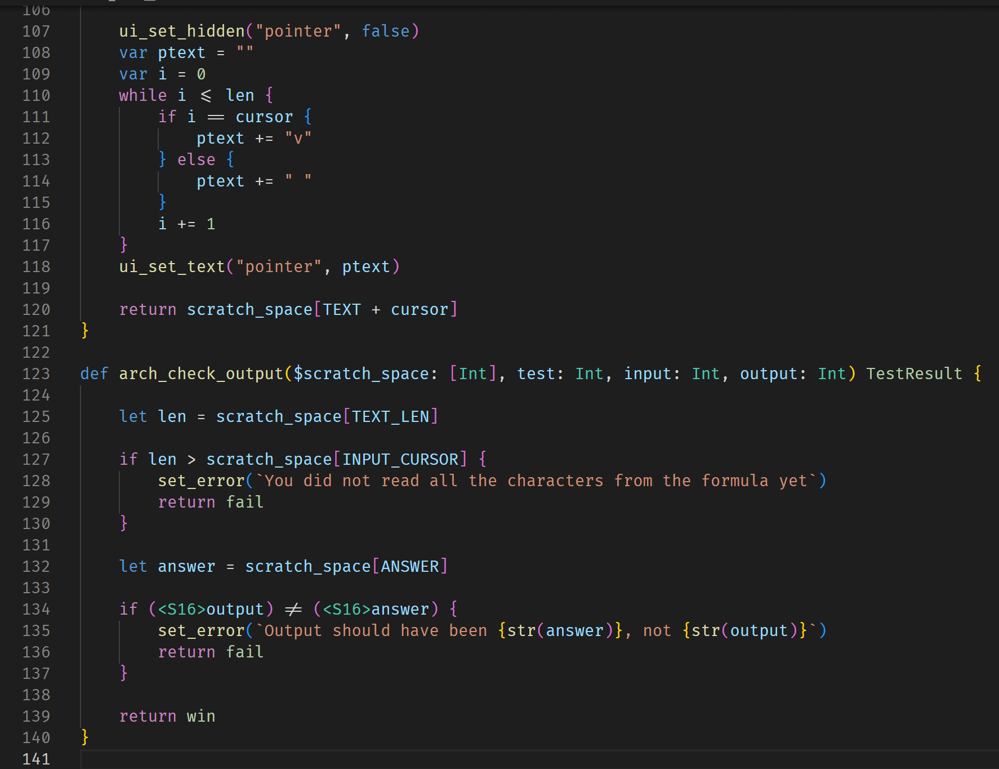

# TC Simplex

TC Simplex is a VSCode language extension that adds basic language support for the Simplex language used in [Turing Complete](https://store.steampowered.com/app/1444480/Turing_Complete/) for writing level tests.

## Features

- Syntax highlighting (strings, types, etc.)
- Basic semantic highlighting (parameters, types, global variables)
- Basic operations (rename, go to definition) for the semantic highlights

## Preview

## Contributing

If you want to contribute to the language extension, feel free to make bugs, feature requests and PRs!

**Enjoy!**
