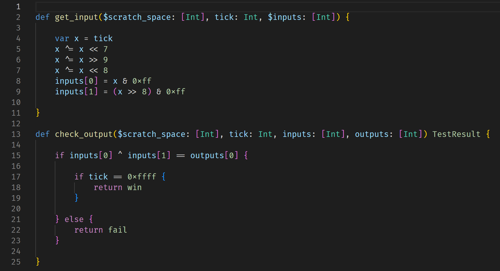

# TC-si

TC-si is a VSCode language extension that adds basic syntax highlighting for the `.si` format that is used in [Turing Complete](https://store.steampowered.com/app/1444480/Turing_Complete/) for writing level tests.

## Features

## Contributing

If you want to contribute to the language extension, feel free to make bugs, feature requests and PRs!

## Release Notes

### 0.0.1

Initial release of the extension

---

**Enjoy!**
